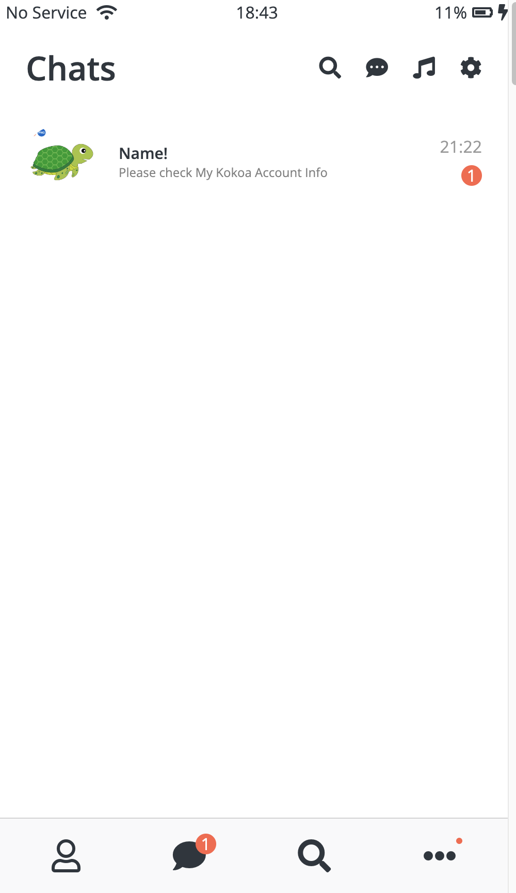
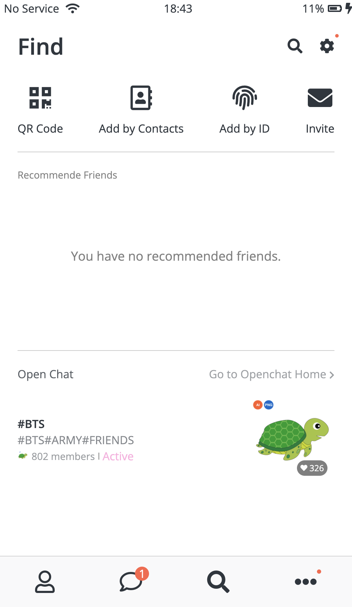
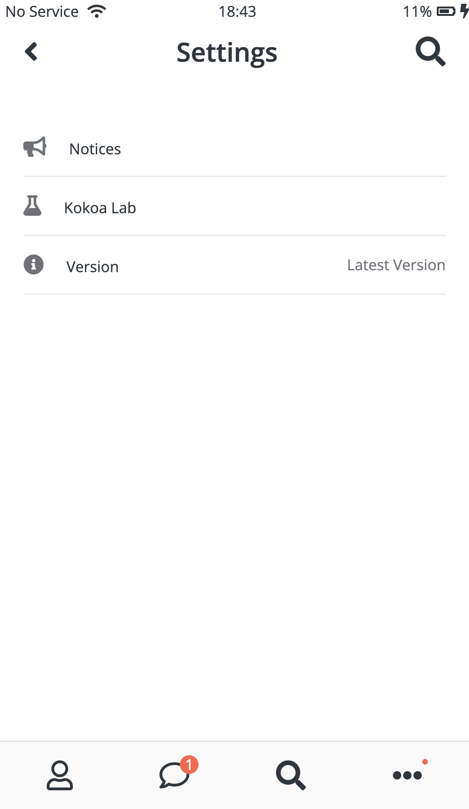
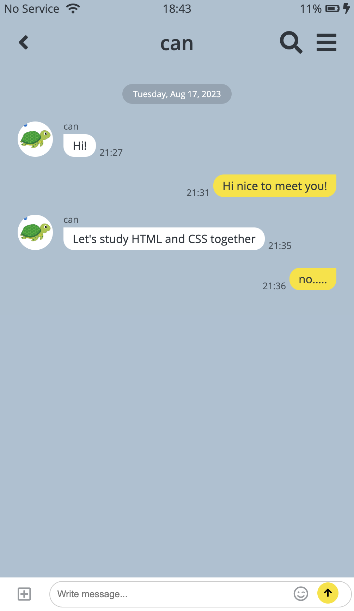

# KakoTalk Clone

Study HTML & CSS!

<!--
    BEM vs id,class

    heroicons vs font awesome
-->

     
     
    [gh-pages](https://odnac.github.io/KakaoTalk-clone/).
     
    
    
    
    
    
    

